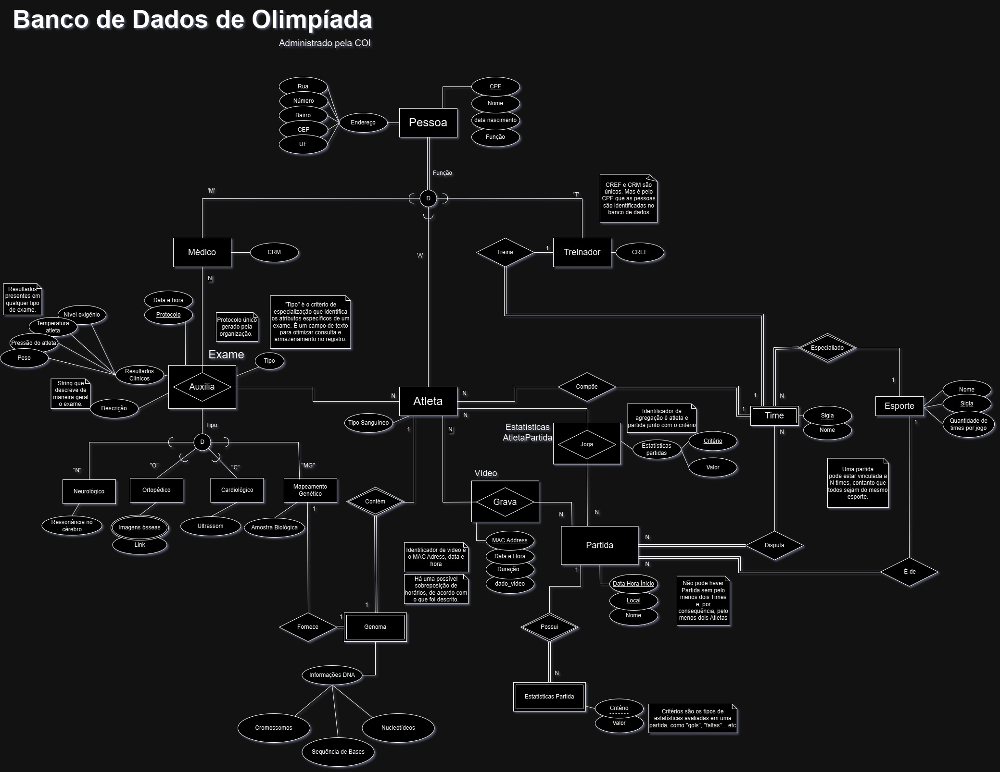

# Monitoramento de Atletas Olímpicos

Este projeto é um sistema de banco de dados relacional para armazenar e gerenciar informações de atletas brasileiros que competiram em uma edição das Olimpíadas. Foi desenvolvido como parte da disciplina **SCC-640 - Bases de Dados**, ministrada pela **Profa. Dra. Elaine Parros Machado de Sousa** no Instituto de Ciências Matemáticas e de Computação (ICMC) da USP (Universidade de São Paulo) - São Carlos.
## Autores

- **Lucas Sales Duarte**
- **Lucas Corlete Alves de Melo**
- **João Victor de Almeida**
- **João Ferreira Battaglini**
- **Jean Carlos Pereira Cassiano**

Todos são alunos de Engenharia de Computação na **Universidade de São Paulo (USP) - Campus São Carlos**.
## Introdução

O monitoramento de atletas de alto rendimento é um tema essencial para a evolução da ciência esportiva e a promoção de melhores práticas de saúde e desempenho. No contexto das Olimpíadas, a competição mais prestigiada do esporte mundial, esse monitoramento se torna ainda mais crítico, dado o elevado nível de exigência física, técnica e psicológica imposto aos competidores. Contudo, as práticas atuais enfrentam desafios significativos, como a fragmentação dos dados, a falta de integração entre diferentes fontes e a dificuldade de análise em larga escala. 

A prática esportiva de alto nível envolve múltiplos fatores que influenciam o desempenho, incluindo:
- Aspectos **físicos**, como força, resistência e flexibilidade;
- Elementos **técnicos e táticos**, específicos de cada modalidade;
- **Componentes psicológicos**, como controle emocional e foco;
- Fatores **genéticos**, que podem indicar predisposições e limitações naturais;
- **Condições ambientais**, como clima, altitude e qualidade do local da competição.

O projeto desenvolvido aborda diretamente esses desafios, propondo a criação de um banco de dados centralizado, robusto e flexível, capaz de armazenar e integrar uma ampla gama de informações. Este banco de dados é projetado para servir como base para análise e pesquisa no esporte, com especial atenção à aplicação de tecnologias de inteligência artificial e machine learning.

### Problemática Atual

Atualmente, as informações sobre atletas estão dispersas em sistemas desconexos e não padronizados, dificultando análises integradas. Dados críticos como vídeos de competições, estatísticas detalhadas de desempenho e registros médicos geralmente são armazenados em plataformas separadas, limitando a capacidade de explorar padrões e insights relevantes. Essa fragmentação prejudica:
- A **personalização de treinos** baseada em dados históricos e genéticos;
- A **prevenção de lesões**, devido à falta de cruzamento entre exames médicos e estatísticas de desempenho;
- A criação de **modelos preditivos de inteligência artificial**, que requerem grandes volumes de dados integrados e de alta qualidade.

Além disso, as práticas atuais apresentam baixa interoperabilidade, com dados frequentemente armazenados em formatos incompatíveis, impossibilitando sua utilização para análises avançadas. A falta de um repositório único e padronizado impede que equipes técnicas, médicos, treinadores e pesquisadores tenham uma visão holística do desempenho e da saúde dos atletas.

### Proposta do Projeto

Este projeto visa resolver essas lacunas por meio do desenvolvimento de um banco de dados abrangente e especializado, com as seguintes capacidades:
- **Centralização de Dados**: Armazenar informações de atletas, treinadores e médicos, bem como vídeos de partidas, estatísticas detalhadas e registros médicos e genéticos.
- **Interoperabilidade**: Permitir a integração com outras plataformas e sistemas, utilizando APIs padronizadas para garantir o fluxo de informações.
- **Otimização de Desempenho e Saúde**: Facilitar análises que identifiquem padrões de alto e baixo rendimento, riscos de lesão e estratégias de prevenção.
- **Treinamento de Redes Neurais**: Fornecer dados robustos para o desenvolvimento de modelos de inteligência artificial focados em predições de desempenho e acompanhamento médico.

O banco de dados abrange múltiplos níveis de informação, permitindo:
- **Armazenamento detalhado de exames médicos**, que vão desde análises simples até mapeamentos genéticos complexos;
- **Relações entre equipes, atletas e treinadores**, conectando esses dados com as estatísticas de desempenho em partidas;
- **Links para vídeos de competições**, que podem ser usados em análises técnicas e para o treinamento de modelos de IA.

## Estrutura do Banco de Dados

O banco de dados foi desenvolvido para atender aos seguintes requisitos:
- **Pessoas**: Dados dos atletas, treinadores e médicos (nome, CPF, endereço, etc.).
- **Times e Esportes**: Relação entre equipes e modalidades esportivas.
- **Partidas e Estatísticas**: Dados sobre competições e desempenho dos atletas.
- **Exames Médicos**: Incluindo exames cardiológicos, neurológicos, ortopédicos e mapeamento genético.
- **Vídeos de Partidas**: Links para vídeos de atletas em ação.

### Modelagem do Banco de Dados

#### Modelo Entidade-Relacionamento (MER)


O Modelo Entidade-Relacionamento (MER) é utilizado para ilustrar as relações entre os diferentes elementos de um banco de dados. Ele foi empregado para elucidar como os atletas, treinadores, médicos, partidas, exames, estatísticas e vídeos interagem dentro do contexto das Olimpíadas. Este modelo auxilia no entendimento lógico das dependências entre entidades e seus atributos, sendo um passo crucial para a estruturação de um banco de dados eficiente.

#### Esquema Relacional (ER)


O Esquema Relacional (ER) representa como as tabelas foram efetivamente criadas no banco de dados. Este modelo deriva diretamente do MER e descreve a implementação física, incluindo a definição de chaves primárias, chaves estrangeiras e relações normalizadas. Ele é essencial para assegurar a integridade e a consistência dos dados, além de otimizar operações de inserção, atualização, exclusão e consultas.

### Otimização de Estruturas

Durante a transição do MER para o Esquema Relacional, foram analisadas diversas estratégias para melhorar o desempenho do banco de dados. A aplicação de técnicas de **normalização** e o esforço para minimizar tuplas espúrias e redundantes garantiram que:
- As operações de inserção, remoção e atualização fossem eficientes.
- As consultas mais frequentes fossem otimizadas.
- Inconsistências nos dados fossem evitadas.

Esse processo resultou em um banco de dados robusto e escalável, capaz de atender às demandas do projeto.

## Aplicação

### Descrição do Projeto

Este projeto consiste em uma aplicação de interface gráfica desenvolvida em Python utilizando a biblioteca Tkinter para interação com o usuário e oracledb para conexão e manipulação de um banco de dados Oracle. A aplicação permite realizar as seguintes operações:

- **Inserção de Dados**: Inserir dados em diversas tabelas do banco de dados, como médicos, treinadores, atletas, esportes, partidas e estatísticas.
- **Consulta de Dados**: Consultar jogadores associados a um esporte específico e seus respectivos dados de genomas e vídeos.

#### Principais Funcionalidades

1. Menu Principal

Exibe as opções de:

- **Inserir Dados**: Permite escolher uma tabela para inserção de dados.
- **Selecionar Dados**: Permite consultar jogadores associados a um esporte.

#### 2. Inserção de Dados

Aplicação possui formulários personalizados para inserção de dados nas tabelas do banco. Cada tabela possui campos específicos, com validações apropriadas.

Estas são algumas das tabelas suportadas:

- Médico
- Treinador
- Atleta
- Time
- Esporte
- Partida
- Estatísticas de Partida
- Disputa

#### 3. Consulta de Dados

Permite buscar jogadores por esporte, se eles satisfazerem a seguinte condição: O Atleta ter vídeos associados em todas as partidas que seu time jogou (exemplo de divisão relacional), exibindo informações como:

- Nome do jogador
- Genoma associado (se cadastrado)
- Links de vídeos relacionados


### Requisitos do Sistema

#### 1. Dependências

- Python 3.8 ou superior
- Bibliotecas Python:
  - **Tkinter**: Inclusa na biblioteca padrão do Python.
  - **oracledb**: Para interação com o Oracle Database.
- Banco de Dados Oracle: Necessário acesso ao servidor Oracle com as credenciais corretas.

#### 2. Configuração do Ambiente

1. Instale o Python em sua máquina.
2. Instale a biblioteca `oracledb` utilizando o comando:
   ```bash
   pip install oracledb
   ```
3. Certifique-se de que o banco de dados Oracle está acessível e que as credenciais fornecidas estão corretas.

### Estrutura do Código

O código é estruturado em várias funções:

- **Funções de Interface Gráfica**: Criam e gerenciam os componentes da interface usando Tkinter.
- **Funções de Conexão e Inserção**: Gerenciam a conexão com o banco de dados e executam consultas SQL para inserir ou buscar dados.

### Principais Arquivos

- `app.py`: Arquivo principal contendo todo o código da aplicação.

### Como Executar

1. Clone ou baixe o repositório com o código fonte.
2. Navegue até o diretório do projeto.
3. Execute o arquivo principal:
   ```bash
   python ./src/app.py
   ```
4. Utilize a interface gráfica para realizar operações no banco de dados.

## Conclusão

O banco de dados proposto é uma ferramenta essencial para melhorar a análise esportiva, a gestão de saúde e a aplicação de tecnologias de inteligência artificial no esporte. Este sistema contribui significativamente para a evolução da ciência esportiva, permitindo um acompanhamento detalhado do desempenho e da saúde dos atletas, além de fomentar o desenvolvimento de novas tecnologias para o esporte.

